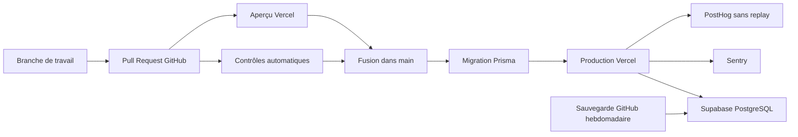

# Vintra — Guide de mise en production

Version : 1.0

Statut : prêt à exécuter

---

# Architecture gratuite retenue

Vercel héberge Next.js. Supabase fournit uniquement PostgreSQL : l’authentification reste gérée par Better Auth et toutes les requêtes passent par Prisma.

# 1. Créer les environnements Supabase

Créer deux projets Supabase :

- `vintra-production` pour les utilisateurs réels ;
- `vintra-preview` pour les aperçus Vercel et les validations.

Pour chaque projet, relever deux chaînes dans **Database > Connect** :

- `DATABASE_URL` : Transaction Pooler, port `6543`, pour l’exécution Vercel ;
- `DIRECT_URL` : Session Pooler, port `5432`, pour les migrations Prisma.

Les mots de passe contenant des caractères spéciaux doivent être encodés dans l’URL. Ne jamais copier ces valeurs dans Git, un ticket ou un message.

# 2. Publier le dépôt sur GitHub

Créer un dépôt GitHub, ajouter ce projet comme dépôt distant, puis pousser la branche de chantier. Ouvrir ensuite une Pull Request vers `main`.

Dans **Settings > Branches**, protéger `main` :

- Pull Request obligatoire ;
- contrôle `Vérifications complètes` obligatoire ;
- branche à jour obligatoire avant fusion ;
- aucun push direct.

# 3. Relier GitHub à Vercel

Importer le dépôt GitHub dans Vercel et conserver :

- Framework : Next.js ;
- Production Branch : `main` ;
- Build Command : défini par `vercel.json` ;
- Install Command : défini par `vercel.json` ;
- déploiements Git automatiques activés.

Activer l’exposition des variables système Vercel. Les aperçus utilisent automatiquement leur propre URL pour Better Auth.

# 4. Variables Vercel

Renseigner les variables dans **Settings > Environment Variables**. Les valeurs de production et d’aperçu doivent pointer vers leurs projets Supabase respectifs.

| Variable | Production | Preview | Sensible |
| --- | --- | --- | --- |
| `DATABASE_URL` | Transaction Pooler production | Transaction Pooler preview | oui |
| `DIRECT_URL` | Session Pooler production | Session Pooler preview | oui |
| `DATABASE_POOL_MAX` | `1` | `1` | non |
| `BETTER_AUTH_SECRET` | secret aléatoire distinct | autre secret aléatoire | oui |
| `BETTER_AUTH_URL` | URL publique définitive | URL publique définitive, remplacée automatiquement sur l’aperçu | non |
| `CRON_SECRET` | secret aléatoire de 32 octets | secret distinct | oui |
| `RESEND_API_KEY` | clé Resend | clé de test ou domaine de test | oui |
| `EMAIL_FROM` | expéditeur vérifié | expéditeur de test | non |
| `WEB_PUSH_PUBLIC_KEY` | clé VAPID publique | clé de test | non |
| `WEB_PUSH_PRIVATE_KEY` | clé VAPID privée | clé de test | oui |
| `WEB_PUSH_SUBJECT` | adresse de contact `mailto:` | adresse de contact | non |
| `NEXT_PUBLIC_SENTRY_DSN` | DSN Sentry | DSN Sentry | non |
| `SENTRY_ORG` | organisation Sentry | organisation Sentry | non |
| `SENTRY_PROJECT` | projet Sentry | projet Sentry | non |
| `SENTRY_AUTH_TOKEN` | jeton d’envoi des source maps | jeton d’envoi des source maps | oui |
| `NEXT_PUBLIC_POSTHOG_KEY` | clé projet PostHog UE | projet de test ou vide | non |
| `NEXT_PUBLIC_POSTHOG_HOST` | `https://eu.i.posthog.com` | même valeur | non |
| `LOG_LEVEL` | `info` | `info` | non |
| `APP_VERSION` | version de `package.json` | même version | non |

Après toute modification de variable, relancer un déploiement : Vercel fige les variables au moment de la construction.

# 5. Surveillance et confidentialité

Créer un projet Next.js gratuit dans Sentry et un projet UE dans PostHog. Vintra :

- n’envoie ni corps de requête, ni cookie, ni en-tête, ni identité à Sentry ;
- désactive le replay, l’autocapture et la persistance PostHog ;
- mesure seulement les pages visitées avec un identifiant conservé en mémoire ;
- masque tous les textes par précaution ;
- retire les secrets et identifiants sensibles des journaux Pino.

# 6. Sauvegardes

Ajouter deux secrets dans **GitHub > Settings > Secrets and variables > Actions** :

- `PRODUCTION_DIRECT_URL` : Session Pooler du projet Supabase de production ;
- `BACKUP_ENCRYPTION_KEY` : phrase aléatoire longue, conservée hors de GitHub dans un coffre-fort.

Le workflow hebdomadaire :

1. exporte uniquement le schéma applicatif `public` ;
2. restaure l’export dans un PostgreSQL 17 temporaire ;
3. vérifie la présence de l’historique Prisma ;
4. chiffre le fichier en AES-256 ;
5. conserve uniquement la version chiffrée pendant 14 jours.

La clé de chiffrement est indispensable pour restaurer une sauvegarde. La perdre rend les archives inutilisables.

# 7. Validation avant ouverture aux testeurs

La Pull Request doit être verte. Sur l’URL d’aperçu, valider dans cet ordre :

1. page d’accueil et navigation mobile ;
2. inscription, connexion, confirmation email et mot de passe oublié ;
3. onboarding complet ;
4. dashboard et profil financier ;
5. création, modification et progression d’un objectif ;
6. recommandations ;
7. paramètres, export et suppression de compte ;
8. notifications et activation Web Push ;
9. `GET /api/health` retourne `200` avec `status: ok` ;
10. la route cron sans jeton retourne `401` ;
11. aucun secret ni donnée financière n’apparaît dans les logs Vercel, Sentry ou PostHog.

Après validation, fusionner dans `main`. Vercel applique les migrations avant la compilation puis active la nouvelle version seulement si le build réussit.

# 8. Retour arrière

En cas d’incident :

1. désactiver temporairement les nouvelles inscriptions si l’intégrité des données est concernée ;
2. sélectionner le dernier déploiement stable dans Vercel et utiliser **Instant Rollback** ;
3. créer une branche `fix/*` ;
4. corriger avec une migration additive ;
5. refaire la Pull Request, les tests et l’aperçu ;
6. ne jamais effacer ou réécrire une migration déjà appliquée.
